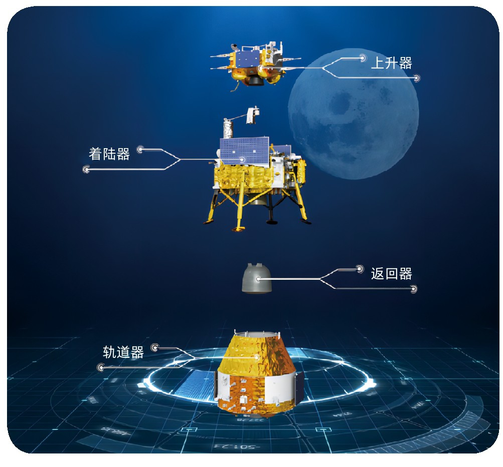
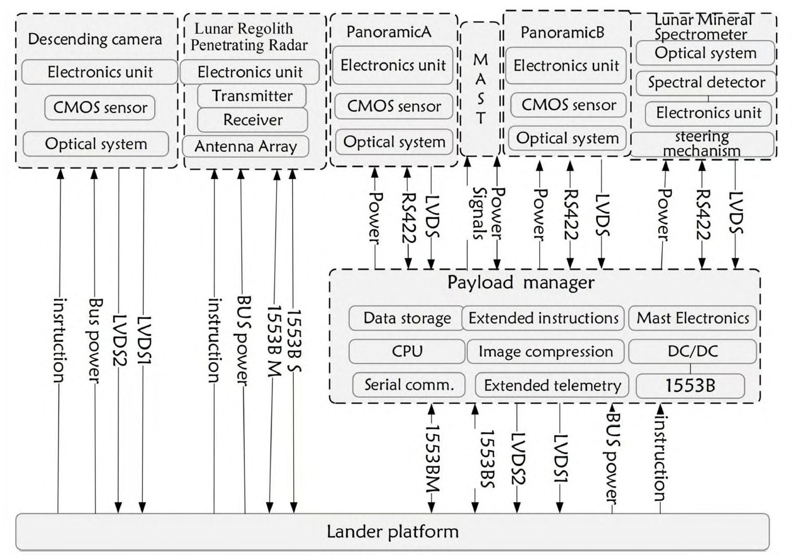
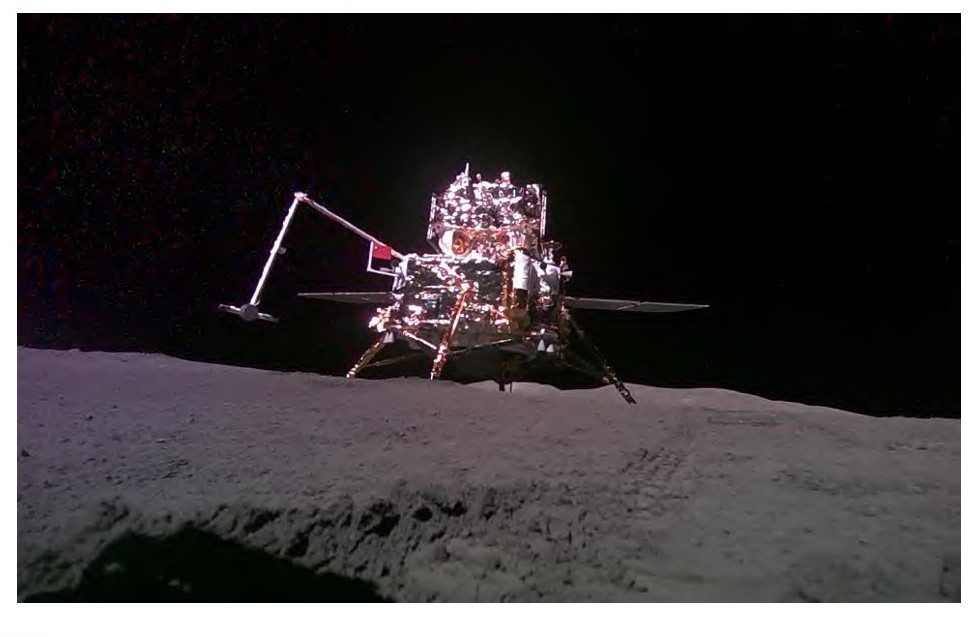
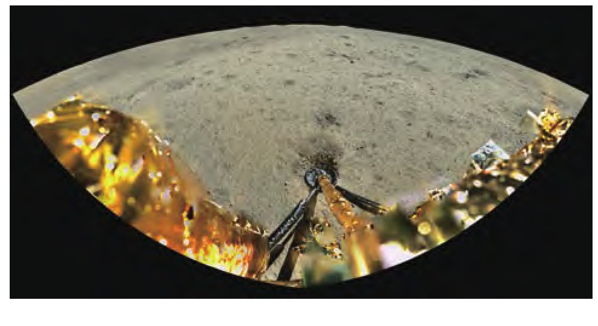
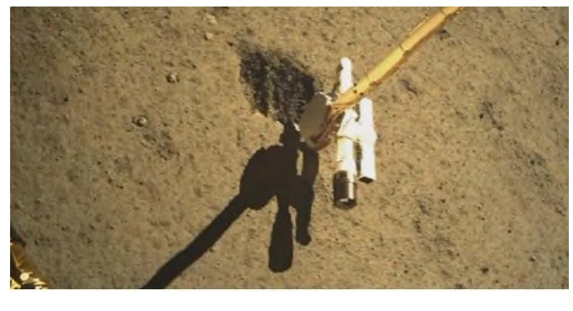
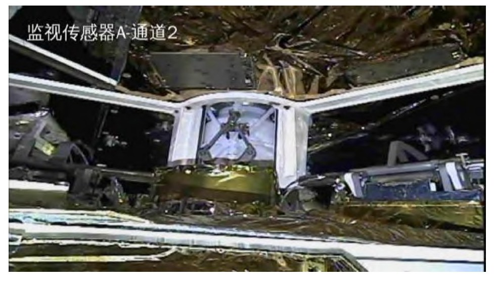

# 嫦娥六号

*图：嫦娥六号示意图*
## 任务简介

嫦娥六号是嫦娥五号的备份，整体结构与嫦娥五号基本一致，但它用于人类首次在月球背面进行采样返回探测，同时开展更广泛的科学探测和国际合作。

该月球采样返回器在月球-艾特肯盆地中纬度地区阿波罗环形山着陆采样。科学家可进一步分析月壤的结构、物理特性、物质组成等，有望在太阳系早期撞击历史、月球背面的火山活动和月球地质演化等重大科学问题上取得新的认识，进一步拓展人类对月球乃至太阳系的认知。

嫦娥六号着陆在这个巨型盆地东北部的阿波罗撞击坑边缘，通过钻取和表取两种方式，采集约2千克月球样品，并开展月表浅层结构、矿物组分、月面形貌等科学探测。由于着陆点位于月球背面无法与地面测控站直接通信，所以通过鹊桥二号月球中继星提供中继通信支持。

---
## 任务目标

### 工程目标

(1)突破月球逆行轨道设计与控制技术；(2)月球背面智能快速采样技术；(3)月背起飞上升技术，实现月球背面自动采样返回；(4)开展有效的国际合作。

### 科学目标

(1)月球背面着陆区的现场调查和分析；(2)月球背面样品的分析与研究。

---
## 任务历史

**2017年**：作为嫦娥五号备份的嫦娥六号探测器被生产出来。
**2022年9月**：嫦娥六号产品基本生产完毕。
**2024年1月9日**：嫦娥六号运送至文昌航天发射场。
**2024年3月15日**：执行嫦娥六号任务的长征五号遥八运载火箭安全运抵中国文昌航天发射场，后与先期运抵的嫦娥六号探测器一起开展发射场区总装和测试工作。
**2024年4月27日**：嫦娥六号探测器和长征五号遥八运载火箭在中国文昌航天发射场完成技术区相关工作后，器箭组合体垂直转运至发射区。
**2024年5月1日**：嫦娥六号月球探测任务组织发射前系统间全区合练。
**2024年5月3日17时27分**：嫦娥六号探测器由长征五号遥八运载火箭在中国文昌航天发射场成功发射，之后准确进入地月转移轨道，发射任务取得圆满成功。
**2024年5月8日10时12分**：嫦娥六号探测器成功实施近月制动，顺利进入周期12小时的环月轨道飞行。
**2024年5月8日16时14分**：嫦娥六号成功释放巴基斯坦CUBE-Q立方卫星。
**2024年5月30日**：着陆器与上升器组合体和轨道器与返回器组合体实现在轨分离。
**2024年6月2日6时**：成功着陆在月球背面南极-艾特肯盆地预选着陆区。
**2024年6月2日至3日**：嫦娥六号顺利完成在月球背面南极-艾特肯盆地的智能快速采样，并将月球背面样品封装存放在上升器携带的贮存装置中。
**2024年6月4日**：表取完成后，嫦娥六号登陆器携带的五星红旗在月球背面成功展开。7时38分，携带月球样品的嫦娥六号上升器自月球背面起飞，随后成功进入预定环月轨道。嫦娥六号完成世界首次月球背面采样和起飞。
**2024年6月6日14时48分**：嫦娥六号上升器成功与轨道器和返回器组合体完成月球轨道的交会对接，并于15时24分将月球样品容器安全转移至返回器中。
**2024年6月25日14时07分**：嫦娥六号成功在内蒙古 "内蒙古自治区"四子王旗预定区域着陆。等待返回器太空舱的搜索队利用直升机在几分钟内就到达了太空舱。

---

## 探测器基本参数

与嫦娥五号基本一样，嫦娥六号仍由轨道器、返回器、着陆器和上升器4部分组成，其中轨道器和返回器约4.35吨，着陆器约3.3吨，上升器约0.7吨。
### 🛰 探测器系统组成：

1. **轨道器**（相当于地月“巴士”，承担着地月往返运输的重要使命）
2. **着陆器**（负责把采集的月球样品带回地球，它要承受超高速进入地球大气层时的高温和冲击，保护样品不受影响）
3. **上升器**（负责携带采集的样品以着陆器作为发射架从月球背面升空飞入月球轨道，然后把采集的样品转移给返回器）
4. **返回器**（装有反推火箭，不仅负责在月面软着陆，着陆后还负责自动对月球采样、样品封装等）

### 🔬 科学载荷：

**中方载荷**：
- 月面立体相机：获取着陆器降落过程中各个高度时着陆区域的月表形貌特征图像。
- 全景相机：获取着陆区月表形貌图像，支撑表取采样点选择，获取月球样品现场图像；
- 月面成分分析仪：现场获取月表样品短波红外发射光谱信息，分析其矿物组成特征，可与月球样品实验室测量结果进行对比研究。
- 月壤结构探测仪：探测着陆点月壤厚度和结构，通过与钻取样品进行对比，反演月壤在相应频段的电磁特性参数，并与实验室测量结果进行对比研究。
- 国旗展示系统：旗面更改为玄武岩纤维旗面，在采样工作完成后展开国旗，实现在月球背面动态展示国旗。

**国际合作载荷**：
- **氡气探测仪**：法国氡气探测仪搭载于着陆器上，对月球表面氡气同位素开展原位探测，测量挥发物在月球表面和月球外层空间传输和扩散，研究月球排气和气体通过月球风化层的传输、月球外逸层中挥发分的运输、月球尘埃的传输和扩散机制。
- **激光角反射器**：意大利激光角反射器搭载于着陆器上，能够作为在月球背面的定位绝对控制点，可以与其他月球探测任务开展联合测距与定位研究，为后续月面高精度定位和月球轨道卫星定轨导航提供支撑。
- **负离子分析仪**：欧空局月表负离子分析仪搭载于着陆器，对月球表面负离子进行探测，研究等离子体和月面的相互作用机制及月球表面逃逸层的物理机制。
- **CUBE-Q立方卫星*：巴基斯坦立方星搭载于轨道器上，在探测器第一次近月制动后的大椭圆轨道远月点与探测器分离，开展在轨对月成像，验证纳卫星月球轨道探测技术。

### “金蟾”号微型月球车

“金蟾”号微型月球车由中国空间技术研究院空间控制技术研究所研制，因其镀金绝缘外壳而得名，有时它也被称作“移动相机”或“自主智能微型机器人”。“金蟾”号重约5千克，在上下两面配备了微型太阳能电池板，前后两端配备了摄像头，这是为了保证其无论以何种姿态从嫦娥六号的侧面挂点释放至月面后均能工作。“金蟾”号搭载了红外成像光谱仪，支持对月球表面成分和月球土壤中水冰存在情况的研究。此外，“金蟾”还负责对嫦娥六号着陆器在月球表面进行成像。

---

## 任务流程

嫦娥六号任务飞行全过程约53天，由11个飞行阶段组成：

**(1)发射入轨段**：2024年5月3日，嫦娥六号由长征五号遥八火箭发射。

**(2)地月转移段**：器箭分离后嫦娥六号沿近地点高度约200千米、远地点高度约38万千米的地月转移轨道飞行约5天，期间进行1～3次中途修正。

**(3)近月制动段**：2024年5月8日，在高度200千米的近月点附近通过嫦娥六号轨道器上的3000牛主发动机实施第1次近月制动减速，使嫦娥六号进入近月点200千米、远月点8600千米、轨道周期12小时的环月椭圆轨道。在该轨道上嫦娥六号择机释放巴基斯坦的立方星开展在轨成像。

**(4)环月飞行段**：从2024年5月8日探测器进入环月轨道开始，直至着陆-上升组合体到达动力下降初始点为止。2024年6月1日，嫦娥六号在环月圆轨道上完成了着陆-上升组合体与轨道-返回组合体的分离，分离后轨道-返回组合体继续环月飞行，等待上升器进行交会对接。

**(5)着陆下降段**：分离后的着陆-上升组合体通过实施2次降轨变轨，进入近月点约15千米、远月点约200千米的椭圆轨道。2024年6月2日实施着陆下降。在动力下降前，着陆-上升组合体与鹊桥二号建立通信链路。在鹊桥二号支持下，着陆-上升组合体在近月点附近约15千米高度处通过着陆器上的1500～7500牛变推力主发动机实施动力下降和着陆，经过主减速段、接近段、悬停避障段、缓速下降段等7个阶段，用时约15分钟，最终在月面预定区域软着陆。

**(6)月面工作段**：着陆-上升组合体着陆后，采用钻取和表取两种采样方式，对月壤取样。其中钻取采样通过特殊的钻头钻到月表以下2米左右的位置，把月壤整体取出来，保持其剖面层序；表取采样通过机械臂和机械爪的配合，在月球表面多个位置铲取月壤或拾取月岩两种月球样品。采集的样品分别转移至位于上升器顶部的样品容器内。样品容器密封后，国旗展开，上升器完成起飞准备。月面工作历时两天。

**(7)月面上升段**：2024年6月4日携带月球样品的上升器以着陆器为平台通过3000牛主发动机点火在月面起飞，加速至月球逃逸速度（约2.4千米/秒）。经过约6分钟的飞行，进入近月点15千米、远月点180千米的上升目标轨道。接着，通过实施4次轨道机动，采用多圈多脉冲共面椭圆轨道交会策略，最终导引至高度为210千米的环月圆轨道上。

**(8)交会对接与样品转移段**：2024年6月6日，当上升器位于轨道-返回组合体前方约50千米、上方约10千米时，该组合体进行主动逼近抓捕。对接机构捕获锁定上升器后，样品转移机构将上升器中的样品容器转移至返回器内部，完成样品转移。此后，轨道-返回组合体择机分离上升器及对接舱段。

**(9)环月等待段**：轨道-返回组合体与上升器分离后，在环月轨道停留约14天，等待月地转移窗口。然后在2024年6月20日通过轨道器上的3000牛主发动机实施两次月地转移入射机动进入月地转移轨道。

**(10)月地转移段**：轨道-返回组合体在月地转移轨道飞行5天后抵达地球附近,其间进行1～3次中途修正。

**(11)再入回收段**：当轨道-返回组合体飞行到达距地球约5000千米高度处，返回器与轨道器分离，并进入高速再入返回跟踪测量链跟踪范围。轨道器进行规避机动。2024年6月25日，返回器在120千米高度以10.9千米/秒速度用半弹道跳跃式再入大气层，着陆于内蒙古四子王旗着陆场，从而完成这趟历时53天的地月往返之旅。地面搜索回收力量在48小时内完成对返回器的回收。

---

## 任务成果

“嫦娥”六号任务采用了月球逆行轨道设计与控制、月背快速采样、月背起飞上升等新技术，在“鹊桥”二号中继星的支持下，获取了着陆区科学探测数据，实现了人类首次月球背面采样返回，取回了1935.3g月球背面样品，是我国建设航天强国、科技强国进程中取得的又一标志性成果，铸就了国际月球探测的又一里程碑。

“嫦娥”六号任务开展了高质量国际合作，实现与法国、欧空局、意大利和巴基斯坦等国家和组织在月球探测领域的深度合作，进一步树立了我国在国际航天领域开放合作、互利共赢的典范，显著提升了我国在国际科技领域的地位和影响力，为后续开展月球探测领域国际合作积累了宝贵经验。即将开展的月球背面样品科学研究，有望取得一系列重大科研成果，为拓展人类知识疆界贡献中国智慧和中国力量。

通过对嫦娥六号月背样品的研究，发现了月球背面样品中独特的矿物组合和稀有元素分布特征,揭示了首份月背古磁场信息,确定了28亿年和42亿年两期次玄武岩岩龄，揭示了月背岩浆活动记录，为理解月球背面和正面的显著地质差异开辟了新视角。嫦娥六号将继续引领月球样品研究的“嫦娥时代”，为更加深入和全面地认识月球作出重要贡献。

---

## 备注

- 嫦娥六号任务采用“全自主”模式完成月背采样返回，具备极高工程复杂性；
- 所搭载的法意等国探测仪器为中国探月工程首次“多国深度参与”模式；
- 任务配套发射的“鹊桥二号”中继星，实现全程月背通信保障；
- 返回样品将在国家月球样品实验室统一管理，并对中外科研机构有序开放；
- 数据与样品将主要支持地外天体地质学、太阳系早期演化、月壤中挥发物等研究领域；
- 所有任务数据及成果信息均由中国国家航天局、国防科工局、探月与深空探测中心发布为准。
- ctrl+单击查看图片。

---
